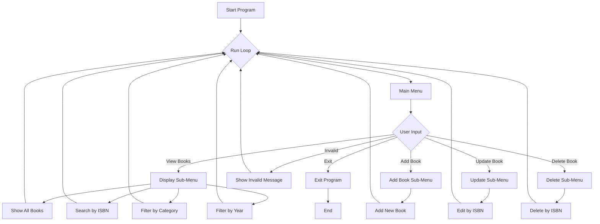

# Capstone-Project-1-by-Purwadhika

## Overview
A Python-based console application simulating a library management system that allows users to Create, Read, Update, and Delete (CRUD) book records. This project uses dictionaries and lists to mock a database (dataBuku) to manage book metadata such as title, author, publication year, ISBN, category, and stock.

## Features

### Create (Add collection of books)
	•	Add a new book with fields: ISBN (unique, 13 digits), title, author (letters, dots, and commas only), year (1800–2025), category (from pre-defined list), and stock (non-negative integer).
	•	Validates inputs at each step to ensure data integrity.
### Read (Display collection of books)
	•	Show all books in a neatly formatted table.
	•	Search for a specific book by ISBN.
	•	Filter and display books by category or publication year.
### Update (Update the data of books)
	•	Select a book via ISBN and update title, author, year, category, or stock (but not ISBN).
	•	Input is validated and final changes require confirmation before they’re saved.
### Delete (Delete collection of books)
	•	Remove a book permanently from the database using ISBN.
	•	Deletion requires confirmation to prevent accidental removals.

## Data Structures

This project uses an in-memory dictionary of lists called dataBuku to simulate a simple database. Each key represents a data field (similar to a column in a database table), and each value is a list containing the corresponding values for each book. Each index across the lists represents one complete book record.

Structure Overview

<pre lang="python"><code>
dataBuku = {
    "Judul": [...],
    "Penulis": [...],
    "Tahun Terbit": [...],
    "ISBN": [...],
    "Kategori": [...],
    "Stock Buku": [...]
}
</code></pre>

Each index i across the lists corresponds to a single book. For example, dataBuku["Judul"][0] refers to the title of the first book in the database.

### Field Descriptions and Validation Rules

    •	Judul          str        Cannot be an empty string.
    •	Penulis        str        Must contain only letters, dots (.), and commas (,); numbers are disallowed.
    •	Tahun Terbit  str        Must be a 4-digit string between 1800 and 2025.
    •	ISBN          str        Must be exactly 13 digits and unique; cannot contain letters or symbols.
    •	Kategori      str        Must be one of the predefined valid categories (e.g., "Sains", "Novel", etc.).
    •	Stock Buku    str        Must be a non-negative integer (e.g., "0", "5", etc.).

## Project Structures
Below is a breakdown of all the major functions used in the project:

### Menu and Navigation
	•	menuutama(): Displays the main menu of the program.
	•	menu1(): Displays submenu options for Feature 1 (View Reports).
	•	menu2(): Displays submenu options for Feature 2 (Add Book).
	•	menu3(): Displays submenu options for Feature 3 (Update Book).
	•	menu4(): Displays submenu options for Feature 4 (Delete Book).
	•	input_menu(): Handles menu selection input from user.
	•	tidakValid(): Informs user when input is invalid.

### Data Display & Header
	•	header(): Prints the table header for book listings.
	•	tampilkanData(i): Displays a single book’s data (row) from index i.

### Feature 1: Read
	•	fitur1a(): Displays all book data in a table format.
	•	fitur1b(): Searches for a book by ISBN.
	•	fitur1c(): Filters books by category.
	•	fitur1d(): Filters books by publication year.
	•	fitur1(): Controller function to route to appropriate Read subfeature.

### Feature 2: Create
	•	fitur2a(): Adds a new book after validating each field.
	•	fitur2(): Controller for the Create feature.

### Feature 3: Update
	•	fitur3a(): Updates an existing book’s details by ISBN.
	•	fitur3(): Controller for the Update feature.

### Feature 4: Delete
	•	fitur4a(): Deletes a book from the database by ISBN.
	•	fitur4(): Controller for the Delete feature.

### Program Control
	•	runProgram(): Main loop function that controls the entire app. Displays menu and handles routing.

## Flowchart

## How to Run
1.	Make sure you have Python 3.7+ installed.
2.	Clone or download the repository.
3.	Run the main file (e.g., main.py) in your terminal or IDE

## Usages
### This console application is intended for:
	•	Practicing basic and intermediate Python programming.
	•	Learning CRUD logic with in-memory data structures.
	•	Simulating simple inventory systems (e.g., library or store).
	•	Understanding menu-driven command-line applications.

## Potential Future Enhancement
	•	Replace dictionary with a persistent database (e.g., SQLite).
	•	Add user authentication (admin vs guest).
	•	Create a GUI version using Tkinter or PyQt.
	•	Export/import data to/from CSV or JSON.
	•	Add search suggestions and sorting functionality.
	•	Implement pagination for large datasets.

## Author
Sulthanur Iman Fatahillah
